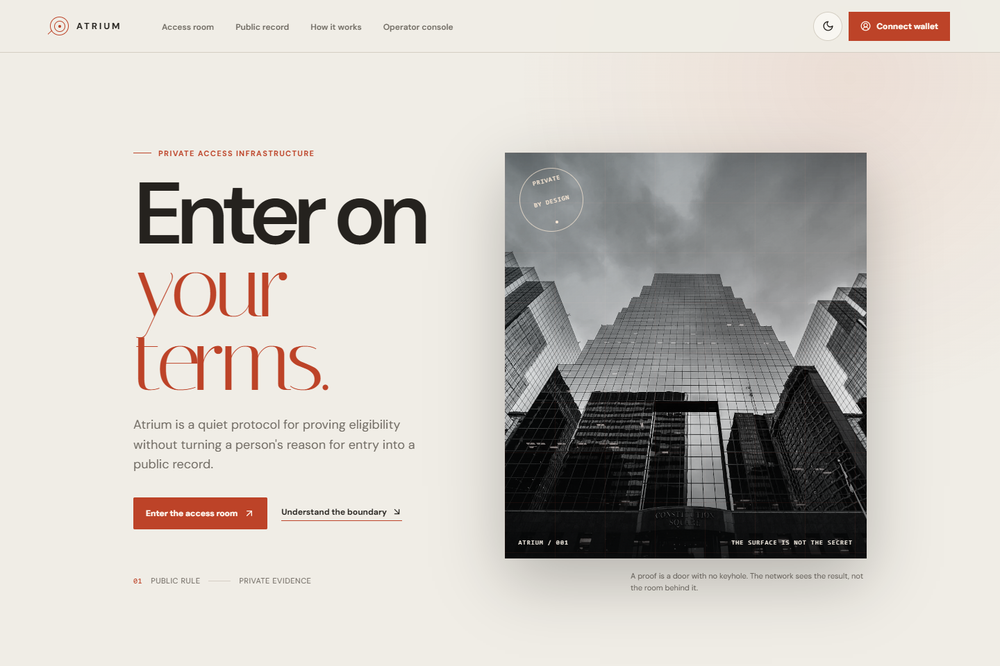
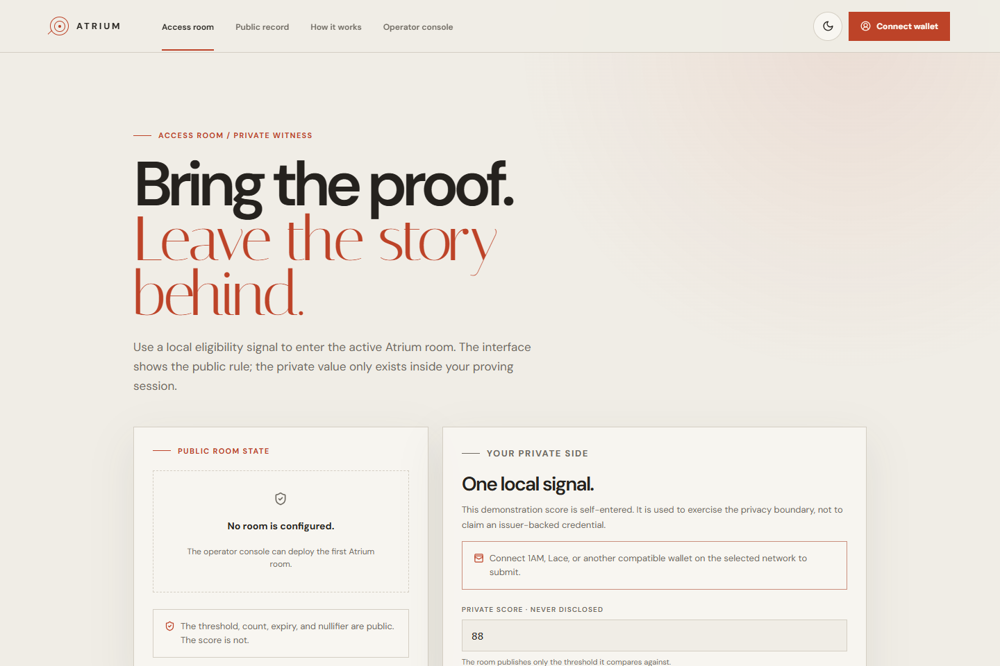
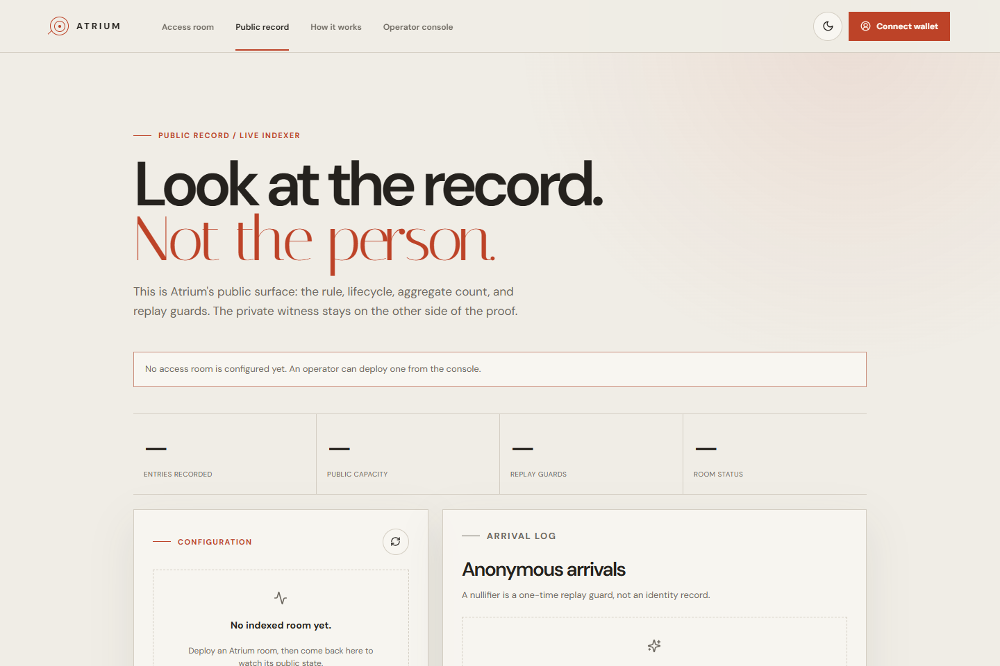
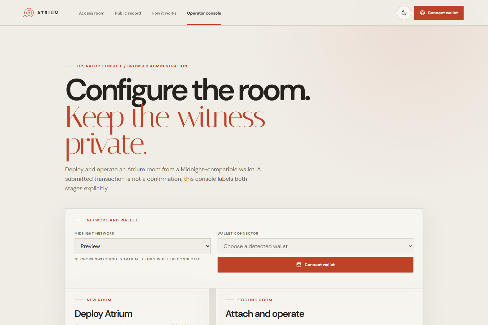
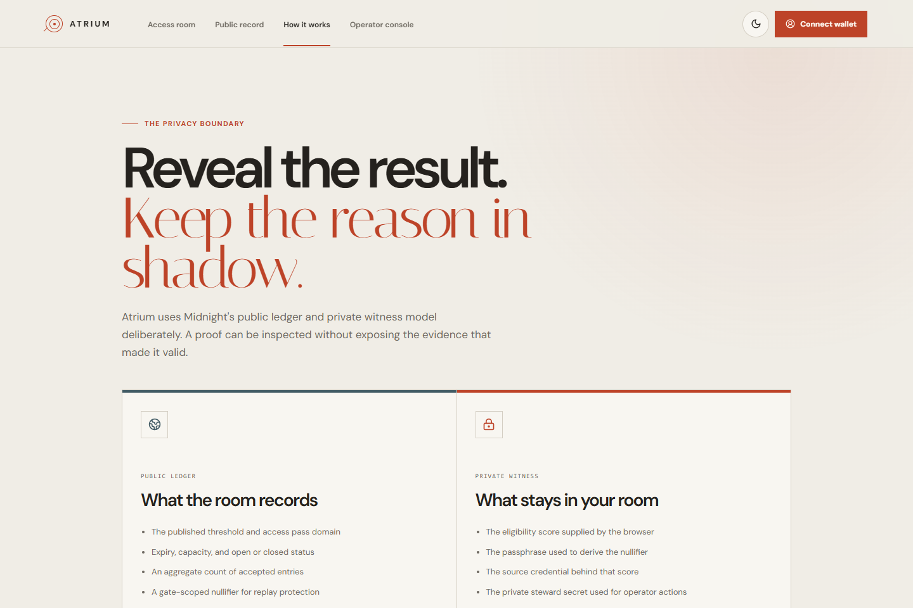
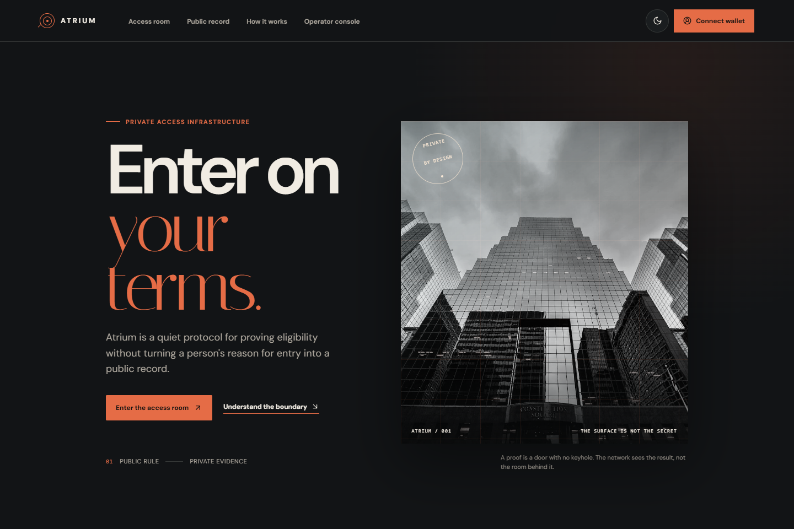
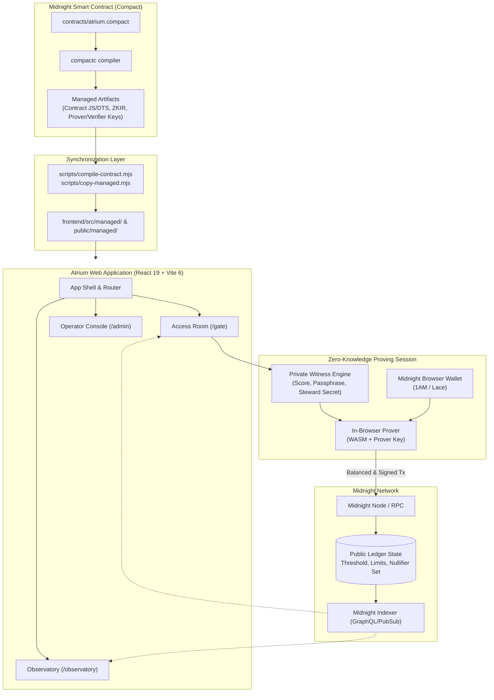

# Atrium

<p align="center">
  <strong>Access without exposure.</strong><br />
  A zero-knowledge selective-disclosure access room and account-neutral eligibility protocol for <a href="https://midnight.network">Midnight Network</a>.
</p>

<p align="center">
  
  
  
  
  
  <a href="https://explorer.1am.xyz/contract/01425e5fd78c1e07bfb45b267b58f8db56ea52d93cbde28c0705902f9bcd87d8"></a>
  
  =22" />
</p>

<p align="center">
  <a href="https://explorer.1am.xyz/contract/01425e5fd78c1e07bfb45b267b58f8db56ea52d93cbde28c0705902f9bcd87d8"><strong>🌐 Live Preprod Contract</strong></a> •
  <a href="https://explorer.1am.xyz/tx/d2e1fbc343a0cb72f88571507737be9e4166886d15fe44655d35b5952ef83c16?network=preprod"><strong>🧾 Verified Deployment Tx</strong></a> •
  <a href="#overview">Overview</a> •
  <a href="#live-preprod-deployment">Live Deployment</a> •
  <a href="#features">Features</a> •
  <a href="#product-walkthrough">Product Walkthrough</a> •
  <a href="#architecture">Architecture</a> •
  <a href="#getting-started">Getting Started</a> •
  <a href="#verification-checklist">Verification Checklist</a>
</p>

---

<p align="center">
  
</p>

---

## 🚀 Live Demo & Deployed Contract (Preprod)

- 🌐 **Live Web Application:** [https://atrium-niv.vercel.app/])
- 🎥 **Demo Video Walkthrough:** [Watch 1-Minute Demo Video](https://github.com/NivritiPandey/Atrium#product-walkthrough)
- 📜 **Contract Address:** `01425e5fd78c1e07bfb45b267b58f8db56ea52d93cbde28c0705902f9bcd87d8`
- 🔍 **Deployment Transaction:** `d2e1fbc343a0cb72f88571507737be9e4166886d15fe44655d35b5952ef83c16`
- 🧭 **1AM Contract Explorer:** [View on 1AM Explorer](https://explorer.1am.xyz/contract/01425e5fd78c1e07bfb45b267b58f8db56ea52d93cbde28c0705902f9bcd87d8)
- 🛡️ **Deployment Status:** Verified on-chain on Midnight Preprod

---

## Contents

- [🚀 Live Demo & Deployed Contract (Preprod)](#-live-demo--deployed-contract-preprod)
- [Overview](#overview)
  - [The Problem](#the-problem)
  - [The Approach](#the-approach)
  - [The Result](#the-result)
  - [Live Preprod Deployment](#live-preprod-deployment)
- [Why Atrium](#why-atrium)
- [Features](#features)
- [Product Walkthrough](#product-walkthrough)
  - [01. Landing & Architectural Surface](#01-landing--architectural-surface)
  - [02. Access Room & Private Witness Proving](#02-access-room--private-witness-proving)
  - [03. Public Record & Ledger Observatory](#03-public-record--ledger-observatory)
  - [04. In-Browser Operator Console](#04-in-browser-operator-console)
  - [05. Privacy Boundary & Philosophy](#05-privacy-boundary--philosophy)
  - [06. Atmospheric Day / Night Themes](#06-atmospheric-day--night-themes)
- [Architecture](#architecture)
  - [System Flow](#system-flow)
  - [Architectural Layers](#architectural-layers)
- [Contract Circuits & Privacy Boundary](#contract-circuits--privacy-boundary)
  - [Public Ledger State](#public-ledger-state)
  - [Private Witnesses](#private-witnesses)
  - [Circuits & Authorization](#circuits--authorization)
- [Technology Stack](#technology-stack)
- [Project Structure](#project-structure)
- [Data Flow](#data-flow)
- [Getting Started](#getting-started)
  - [Prerequisites](#prerequisites)
  - [Installation](#installation)
  - [Environment Variables](#environment-variables)
  - [Running the Project](#running-the-project)
  - [Local Midnight Sandbox](#local-midnight-sandbox)
- [Testing](#testing)
- [Build & Distribution](#build--distribution)
- [Deployment](#deployment)
- [Security & Scope Notes](#security--scope-notes)
- [Project Status & Hackathon Readiness](#project-status--hackathon-readiness)
- [Roadmap](#roadmap)
- [Known Limitations](#known-limitations)
- [Verification Checklist](#verification-checklist)
- [Contributing](#contributing)
- [License](#license)

---

## Overview

**Atrium** is an end-to-end reference implementation of a selective-disclosure access room built on [Midnight Network](https://midnight.network). It establishes an **account-neutral eligibility gate** where an operator publishes a verifiable public rule (threshold, pass identifier, expiration deadline, and room capacity), and a visitor proves client-side that an eligibility signal satisfies the threshold—without placing the underlying score, passphrase, or source credential on the public ledger.

### The Problem

Conventional allowlists, token gates, and credential checks require users to disclose their public key, identity graph, or specific qualifying balance to prove access rights. Even pseudonymous on-chain allowlists create permanent, linkable public trails:

1. **Identity Exposure:** Verifying an address leaks wallet balance, transaction history, and associated decentralized identity.
2. **Over-Disclosed Evidence:** Proving you qualify for a tier (e.g., credit score > 700 or balance > 10,000) usually forces you to reveal the exact number rather than merely proving the condition is met.
3. **Linkable Activity Graphs:** Repeated access attempts allow third-party observers to correlate visit times, frequency, and cross-dApp patterns.

### The Approach

Atrium separates the **access rule** from the **access evidence**:

```text
Operator defines public rule (Threshold, Pass Domain, Expiry, Capacity)
                           ↓
Visitor enters private eligibility signal + passphrase locally
                           ↓
Compact circuit generates ZK proof client-side inside browser wallet
                           ↓
Contract verifies proof, derives unique domain nullifier, and records anonymous entry
                           ↓
Ledger increments admission count without storing the visitor's identity or score
```

### The Result

- **The Operator** receives a tamper-proof on-chain guarantee that every admitted visitor cleared the gate rule, that capacity limits are honored, and that expired passes are rejected.
- **The Visitor** gains entry without publishing their score, passphrase, or linkable account credentials to the ledger.
- **The Public** can independently verify the room's health, total admissions, and remaining capacity in real-time through the Observatory.

### Live Preprod Deployment

Atrium is deployed and verified on **Midnight Preprod**:

| Resource | Value / Explorer Link |
|---|---|
| **Contract Address** | [`01425e5fd78c1e07bfb45b267b58f8db56ea52d93cbde28c0705902f9bcd87d8`](https://explorer.1am.xyz/contract/01425e5fd78c1e07bfb45b267b58f8db56ea52d93cbde28c0705902f9bcd87d8) |
| **Deployment Transaction** | [`d2e1fbc343a0cb72f88571507737be9e4166886d15fe44655d35b5952ef83c16`](https://explorer.1am.xyz/tx/d2e1fbc343a0cb72f88571507737be9e4166886d15fe44655d35b5952ef83c16?network=preprod) |
| **Target Network** | Midnight Preprod (`network=preprod`) |
| **Block Explorer** | [1AM Explorer](https://explorer.1am.xyz) |

---

## Why Atrium

| Traditional Allowlist / Token Gate | Atrium Zero-Knowledge Access Gate |
|---|---|
| Forces visitor to reveal public wallet address or KYC record | Evaluates a zero-knowledge private witness client-side inside the browser |
| Exposes exact balance or score on-chain to prove qualification | Discloses only a boolean inequality predicate (`score >= threshold`) |
| Allowlist addresses can be scraped, doxed, and linked across platforms | Uses domain-separated nullifiers (`persistentHash(["ATRIUM:nullifier:v1", pass, secret])`) |
| Replay attacks prevented by recording user address in a public list | Replay prevented anonymously by writing single-use nullifiers to a `Set<Bytes<32>>` |
| Requires centralized backend to manage secrets or custody lists | Fully decentralized Compact smart contract deployed directly to Midnight Network |

---

## Features

### Core Zero-Knowledge Access Engine
- **Private Witness Evaluation:** Validates eligibility scores strictly within the prover session. The witness value never appears in transaction arguments or public transcript data.
- **Domain-Separated Replay Guards:** Derives single-use entry nullifiers using cryptographic hashes (`persistentHash`), binding the secret passphrase to the active pass domain to stop replay attacks without tracking user accounts.
- **Dynamic Gate Rotation:** Room operators can rotate access pass domains, adjust eligibility thresholds, extend expiration deadlines, or expand capacity without redeploying the contract.
- **Emergency Gate Control:** Stewards can atomically pause (`close_gate`) or resume (`open_gate`) admissions using zero-knowledge steward authorization proofs.

### User Experience & Web Client
- **Browser Wallet Integration:** Direct DApp Connector integration supporting Midnight-compatible wallets (Lace, 1AM) across Preview and Preprod networks.
- **In-Browser Operator Console:** Deploy fresh Atrium contracts directly from the UI, initialize constructor parameters, and manage room lifecycle states.
- **Live Public Observatory:** Real-time visibility into indexed contract parameters, admission capacity, remaining slots, pass expiration, and recorded nullifiers.
- **Atmospheric Editorial Design:** Bespoke dual-mode architectural visual system featuring custom typography (*Italiana* and *DM Sans*), dark/light palettes, and fluid responsive layouts.

### Developer Experience & Reliability
- **Automated Managed Synchronization:** Dedicated Node.js scripts compile Compact circuits and synchronize contract bindings, ZKIR circuit IR, and prover/verifier keys between contracts and web clients.
- **Deterministic Testing Suite:** Comprehensive Vitest test harness validating contract initialization, boundary conditions, replay protection, operator rotation, and full access workflows.
- **Production Headers & WASM Support:** Pre-configured Netlify and Vercel headers (`Cross-Origin-Opener-Policy: same-origin`, `Cross-Origin-Embedder-Policy: require-corp`) required for multithreaded in-browser ZK proving.

---

## Product Walkthrough

### 01. Landing & Architectural Surface

The entrance sets the tone for private access infrastructure: a clean architectural presentation that introduces the separation between public room rules and private visitor evidence.

<p align="center">
  
</p>

---

### 02. Access Room & Private Witness Proving

Visitors view the public threshold and room status on the left, while entering their private demonstration score on the right. The score is evaluated locally inside the ZK proving session and never touches the network.

<p align="center">
  
</p>

---

### 03. Public Record & Ledger Observatory

The Observatory monitors the live indexed state of the room: current threshold, total admissions vs. limit, expiration date, active pass domain, and the cryptographic arrival log of used nullifiers.

<p align="center">
  
</p>

---

### 04. In-Browser Operator Console

Operators configure room parameters, select network targets (Preview or Preprod), generate steward commitments, deploy fresh contracts via browser wallets, and perform lifecycle actions (Pause, Resume, Rotate).

<p align="center">
  
</p>

---

### 05. Privacy Boundary & Philosophy

A dedicated architectural explainer clarifies the exact boundaries of Midnight's public/private execution model, transparently noting what is public by design versus what remains in the visitor's local proving session.

<p align="center">
  
</p>

---

### 06. Atmospheric Day / Night Themes

Atrium features an intentional, warm architectural aesthetic across both daytime editorial stone and nighttime obsidian surfaces, toggled effortlessly from the top bar.

<p align="center">
  
</p>

---

## Architecture

Atrium is structured across three core layers: Compact Smart Contract & ZK circuits, Managed Tooling & Bindings, and a React 19 Frontend with Midnight.js browser wallet integration.

### System Flow



### Architectural Layers

#### 1. Compact Contract Layer (`contracts/`)
Written in Compact (Midnight's domain-specific smart contract language). It defines public ledger variables, private witness interfaces, constructor validation, and four export circuits (`prove_entry`, `rotate_gate`, `close_gate`, `open_gate`).

#### 2. Managed Artifacts Layer (`contracts/managed/atrium/`)
Produced by `compactc`. Includes:
- `contract/`: TypeScript definitions (`index.d.ts`), JavaScript runtime bindings (`index.js`), and sourcemaps.
- `zkir/`: Binary and text zero-knowledge intermediate representations for each circuit.
- `keys/`: Prover (`.prover`) and verifier (`.verifier`) keys for client-side proof generation and on-chain verification.

#### 3. Client Application Layer (`frontend/`)
A React 19 single-page application built with Vite 6. Utilizes `@midnight-ntwrk/midnight-js-contracts`, `@midnight-ntwrk/wallet-sdk`, and RxJS for reactive ledger state subscriptions, wallet connection handling, and cryptographic witness derivation.

---

## Contract Circuits & Privacy Boundary

Midnight's execution model enforces strict boundaries: values stored in `export ledger` are publicly visible on-chain; values returned by `witness` never leave the proving sandbox unless explicitly disclosed via `disclose()`.

```text
┌─────────────────────────────────────────────────────────────┐
│                       PUBLIC LEDGER                         │
│                                                             │
│  • entry_threshold (Uint<64>)      • total_entries (Counter)│
│  • access_pass_id (Bytes<32>)      • entry_limit (Uint<32>) │
│  • entry_deadline (Uint<64>)       • used_nullifiers (Set)  │
│  • curator_id (Bytes<32>)          • entry_log (Map)        │
│  • steward (Bytes<32>)             • edition ("ATRIUM:v1")  │
│  • gate_open (Boolean)                                      │
└──────────────────────────────▲──────────────────────────────┘
                               │ disclose()
┌──────────────────────────────┴──────────────────────────────┐
│                  PRIVATE PROVING SANDBOX                    │
│                                                             │
│  Witness Inputs:                                            │
│  • get_eligibility_score() → Uint<64>                       │
│  • get_passphrase() → Bytes<32>                             │
│  • steward_secret() → Bytes<32>                             │
│                                                             │
│  Circuit Constraints:                                       │
│  ✓ assert(score >= entry_threshold)                         │
│  ✓ nullifier = persistentHash([domain, pass, secret])       │
│  ✓ assert(!used_nullifiers.member(nullifier))               │
│  ✓ assert(steward == persistentHash([domain, sk]))          │
└─────────────────────────────────────────────────────────────┘
```

### Public Ledger State

| Ledger Field | Type | Description |
|---|---|---|
| `entry_threshold` | `Uint<64>` | Minimum score value required for admission |
| `access_pass_id` | `Bytes<32>` | Active pass domain salt for nullifier scoping |
| `entry_deadline` | `Uint<64>` | Unix timestamp cutoff for pass validity |
| `curator_id` | `Bytes<32>` | Public identifier for room curator / event host |
| `steward` | `Bytes<32>` | Cryptographic hash commitment of operator secret key |
| `gate_open` | `Boolean` | Current admission status (open or paused) |
| `total_entries` | `Counter` | Cumulative count of admitted visitors |
| `entry_limit` | `Uint<32>` | Maximum lifetime capacity for this room |
| `used_nullifiers` | `Set<Bytes<32>>` | Collection of consumed nullifiers preventing replay |
| `entry_log` | `Map<Bytes<32>, Bytes<32>>` | Mapping of consumed nullifier to pass domain ID |
| `edition` | `Bytes<32>` | Fixed protocol tag (`ATRIUM:v1`) |

### Private Witnesses

| Witness Name | Return Type | Evaluated In | Privacy Protection |
|---|---|---|---|
| `get_eligibility_score` | `Uint<64>` | `prove_entry` | Evaluated against `entry_threshold`. Never published. |
| `get_passphrase` | `Bytes<32>` | `prove_entry` | Hashed with pass domain to derive nullifier. Never published. |
| `steward_secret` | `Bytes<32>` | `rotate_gate`, `close_gate`, `open_gate` | Hashed with steward domain. Proves operator authority without key reveal. |

### Circuits & Authorization

- **`prove_entry(): []`**  
  Asserts gate is open, deadline has not expired, capacity limit is not reached, and visitor's private score clears threshold. Calculates entry nullifier, checks set membership to prevent replay, inserts nullifier, and increments total entries.
- **`rotate_gate(new_threshold, new_pass, new_deadline, new_curator, new_limit): []`**  
  Requires valid steward secret witness matching stored hash commitment. Updates room parameters and rotates pass domain.
- **`close_gate(): []`**  
  Steward-only circuit to halt admissions (`gate_open = false`).
- **`open_gate(): []`**  
  Steward-only circuit to resume admissions after deadline and capacity validation.

---

## Technology Stack

| Layer | Technology | Version | Purpose |
|---|---|---|---|
| **Smart Contract** | [Compact](https://docs.midnight.network) | `0.22.0+` | Zero-knowledge smart contract language for Midnight Network |
| **Contract Tooling** | `compactc` | `0.31.x` | Compact compiler generating ZKIR, TS bindings, and proving keys |
| **Frontend Framework** | [React](https://react.dev) | `19.0.0` | User interface and reactive client application |
| **Build Tool** | [Vite](https://vite.dev) | `6.0.0` | Fast web dev server and production asset bundler |
| **Language** | [TypeScript](https://www.typescriptlang.org) | `5.7.3` | End-to-end type safety across contracts, scripts, and UI |
| **ZK Runtime** | `@midnight-ntwrk/compact-runtime` | `0.16.0` | On-chain and off-chain Compact execution runtime |
| **Midnight Protocols** | `@midnight-ntwrk/midnight-js-*` | `4.1.1` | Contract management, indexer data providers, and ZK config |
| **Wallet Connector** | `@midnight-ntwrk/wallet-sdk` | `1.0.0` | Browser DApp connector (Lace / 1AM integration) |
| **Testing Harness** | [Vitest](https://vitest.dev) | `4.1.0` | Deterministic unit and integration test framework |
| **WebAssembly** | `vite-plugin-wasm` | `3.4.1` | Native WASM support for in-browser Midnight ledger runtimes |
| **Icons & Style** | Lucide React + Vanilla CSS | `1.16.0` | Semantic, accessible UI styling with CSS custom properties |

---

## Project Structure

```text
TraceX/
├── .github/
│   └── workflows/
│       ├── ci.yaml                    # Automated test & typecheck workflow
│       └── deploy.yaml                # Build verification workflow
├── contracts/
│   ├── atrium.compact                 # Core Compact ZK contract source
│   ├── index.ts                       # Contract exports and TypeScript bindings
│   ├── README.md                      # Contract-specific documentation
│   └── managed/atrium/                # Generated compiler output
│       ├── atrium-artifacts.json      # Artifact inventory and circuit hashes
│       ├── compiler/contract-info.json# Compact compiler build metadata
│       ├── contract/                  # index.js, index.d.ts, index.js.map
│       ├── keys/                      # *.prover and *.verifier keys for 4 circuits
│       └── zkir/                      # *.bzkir and *.zkir circuit IR representations
├── design-system/
│   └── atrium/MASTER.md               # Visual design tokens, typography, and palette
├── docs/
│   └── screenshots/                   # Verified UI walk-through screenshots
│       ├── landing.png
│       ├── access-room.png
│       ├── observatory.png
│       ├── operator-console.png
│       ├── philosophy.png
│       └── night-mode.png
├── frontend/
│   ├── index.html                     # Web entry point
│   ├── netlify.toml                   # Frontend deployment configuration
│   ├── package.json                   # Frontend dependencies
│   ├── tsconfig.json                  # Frontend TypeScript configuration
│   ├── vite.config.ts                 # Vite bundler, WASM plugin, and node aliases
│   ├── public/
│   │   ├── _headers                   # COOP/COEP headers for WASM threading
│   │   ├── _redirects                 # SPA client routing redirects
│   │   ├── favicon.svg                # Atrium logo
│   │   ├── fonts/                     # Self-hosted Italiana and DM Sans web fonts
│   │   ├── images/                    # Architectural assets (architecture.webp, interior.webp)
│   │   └── managed/                   # Synced ZK keys and runtime artifacts for browser
│   └── src/
│       ├── App.tsx                    # Main layout, topbar, theme state, and routing
│       ├── config.ts                  # Network configurations (local/preview/preprod)
│       ├── index.css                  # Design system tokens and responsive styles
│       ├── main.tsx                   # React root mount
│       ├── polyfills.ts               # Browser polyfills (Buffer, crypto)
│       ├── contexts/
│       │   └── WalletContext.tsx      # Midnight DApp connector wallet provider
│       ├── hooks/
│       │   ├── useContractState.ts    # Polling hook for live ledger state
│       │   └── useNetwork.ts          # Network switching state hook
│       ├── lib/
│       │   ├── contract.ts            # Contract deployment and circuit call helpers
│       │   ├── identity.ts            # Local identity and nullifier verification
│       │   ├── indexer.ts             # Indexer GraphQL query utilities
│       │   ├── midnight.ts            # Hex conversions and cryptographic utilities
│       │   ├── private-memory.ts      # Ephemeral in-memory storage for secrets
│       │   └── validation.ts          # Form inputs and error formatting
│       ├── managed/contract/          # Synced TypeScript bindings for frontend
│       └── pages/
│           ├── AdminPage.tsx          # Operator deployment & room management
│           ├── GatePage.tsx           # Visitor access room and proof submission
│           ├── LandingPage.tsx        # Hero and overview presentation
│           ├── ObservatoryPage.tsx    # Live ledger inspector and arrival log
│           └── PhilosophyPage.tsx     # Privacy boundary educational view
├── scripts/
│   ├── compile-contract.mjs           # Compiles Compact contract via compactc
│   ├── copy-managed.mjs               # Copies managed artifacts to frontend
│   ├── inspect-preprod.mjs            # Diagnostic script for Preprod network
│   ├── managed-artifacts.mjs          # Artifact manifest helper
│   ├── verify-artifacts.mjs           # Validates presence of all 20 required keys
│   └── wait-for-dust.ts               # Utility to poll for testnet DUST arrival
├── src/
│   ├── config.ts                      # Network provider configuration for tests
│   ├── providers.ts                   # Midnight testkit provider factory
│   └── test/
│       ├── access-flow.test.ts        # Integration tests for end-to-end access flow
│       └── atrium.test.ts             # Comprehensive unit tests for contract circuits
├── .env.preprod.example               # Example Preprod environment variables
├── .gitignore                         # Git exclusion rules
├── .nvmrc                             # Pinned Node.js version (v22)
├── compose.yml                        # Docker Compose configuration for local Midnight stack
├── LICENSE                            # MIT License
├── netlify.toml                       # Root Netlify configuration
├── package.json                       # Root workspace configuration & test scripts
├── PROPOSAL.md                        # Original product proposal and problem definition
├── README.md                          # Master documentation
├── tsconfig.json                      # Root TypeScript configuration
├── vercel.json                        # Vercel deployment configuration
└── vitest.config.ts                   # Vitest configuration for contract testing
```

---

## Data Flow

```text
Visitor Input (Browser)
 │  Eligibility score + secret passphrase
 ▼
Witness Construction (Client Memory)
 │  Score & Passphrase provided as witness callbacks
 ▼
Circuit Constraint Execution (WASM Prover)
 │  Asserts: score >= entry_threshold
 │  Computes: nullifier = persistentHash(["ATRIUM:nullifier:v1", passphrase, pass_id])
 │  Asserts: !used_nullifiers.member(nullifier)
 ▼
Proof Generation
 │  Generates ZK proof without disclosing witness variables
 ▼
Transaction Submission (Midnight Wallet)
 │  Balances transaction fees (DUST) and submits unproven/proven tx
 ▼
On-Chain Verification (Midnight Node)
 │  Verifies ZK proof against verifier key
 │  Applies ledger mutation: increments total_entries, adds nullifier to set
 ▼
Observation & Feedback
    Live indexer detects state change; Observatory and Gate UI reflect updated capacity
```

---

## Getting Started

### Prerequisites

- **Node.js:** `>= 22.0.0` (Use [nvm](https://github.com/nvm-sh/nvm): `nvm use` reads `.nvmrc`)
- **Package Manager:** `npm >= 10.0.0`
- **Compact Compiler:** `compactc >= 0.31.x` (Only required if modifying `.compact` source files; follow [Midnight Docs](https://docs.midnight.network))
- **Docker Desktop:** Required for running the local Midnight development stack (`compose.yml`)
- **Browser Wallet:** Midnight Lace or 1AM wallet extension installed in Chrome or Brave

### Installation

Clone the repository and install dependencies:

```bash
git clone https://github.com/NivritiPandey/Atrium.git
cd Atrium
npm install
```

### Environment Variables

Copy the example environment file for frontend configuration:

```bash
cp frontend/.env.example frontend/.env
```

| Variable | Required | Default | Description |
|---|---|---|---|
| `VITE_MIDNIGHT_NETWORK` | No | `preprod` | Target network (`local`, `preview`, `preprod`) |
| `VITE_CONTRACT_ADDRESS` | No | `01425e5fd78c1e07bfb45b267b58f8db56ea52d93cbde28c0705902f9bcd87d8` | Active Preprod deployed contract address |
| `VITE_INDEXER_URL` | No | *(derived)* | Custom GraphQL indexer endpoint |
| `VITE_PROOF_SERVER_URL` | No | *(derived)* | Custom proof server endpoint |

### Running the Project

Start the local development server:

```bash
npm run dev
```

The application will start at `http://localhost:5173`.

### Local Midnight Sandbox

To test against a completely local Midnight node, indexer, and proof server:

```bash
# Start local containers
npm run env:up

# Run tests against local stack
npm run test:local

# Tear down local containers
npm run env:down
```

---

## Testing

Atrium includes a comprehensive automated test suite powered by Vitest, testing both contract circuit logic and end-to-end access flows.

```bash
npm test
```

### Test Coverage Summary

```text
✓ src/test/atrium.test.ts (17 tests)
  ✓ initializes the public gate and lifetime counters
  ✓ rejects an empty pass identifier at construction
  ✓ rejects zero thresholds, capacities, and curator identifiers at construction
  ✓ accepts a self-asserted eligible score and increments lifetime entries
  ✓ rejects a self-asserted score below the threshold
  ✓ prevents replay for the same passphrase and pass domain
  ✓ allows distinct passes for distinct pass domains
  ✓ rejects entry when the gate is closed
  ✓ rejects entry past the deadline
  ✓ rejects entry at or beyond lifetime capacity
  ✓ allows authorized steward to rotate the gate configuration
  ✓ preserves lifetime entries when rotating the pass
  ✓ rejects steward rotation with an invalid secret
  ✓ rejects rotation with an identical pass identifier
  ✓ allows steward to close the gate
  ✓ allows steward to reopen the gate
  ✓ rejects unauthorized closure and opening

✓ src/test/access-flow.test.ts (5 tests)
  ✓ models a realistic visitor entry lifecycle
  ✓ handles multi-visitor arrival sequences
  ✓ validates boundary edge-case transitions
  ✓ confirms state immutability across query contexts
  ✓ enforces nullifier domain separation

Test Files:  2 passed (2)
Tests:       22 passed (22)
Duration:    1.61s
```

Run test variants:
```bash
npm run test:preview   # Run against Preview testnet endpoints
npm run test:preprod   # Run against Preprod testnet endpoints
npm run check          # Run typecheck, frontend typecheck, tests, and build
```

---

## Build & Distribution

To create a production-ready web bundle:

```bash
npm run build
```

The build process:
1. Builds the `atrium-web` package with Vite 6.
2. Synchronizes WebAssembly binaries and managed contract artifacts.
3. Outputs production distribution files into `dist/`.

Validate artifact integrity:
```bash
npm run verify:artifacts
# Outputs: ATRIUM generated artifacts verified (20 files, four prover/verifier key pairs).
```

---

## Deployment

### Netlify Deployment
Atrium includes complete Netlify configuration (`netlify.toml` and `frontend/netlify.toml`) including single-page application redirects and required COOP/COEP headers for client-side WASM execution:

```toml
[[headers]]
  for = "/*"
  [headers.values]
    Cross-Origin-Opener-Policy = "same-origin"
    Cross-Origin-Embedder-Policy = "require-corp"

[[redirects]]
  from = "/*"
  to = "/index.html"
  status = 200
```

### Vercel Deployment

Atrium is 100% Vercel deployment ready via the root [`vercel.json`](vercel.json) configuration:

1. **Import the repository** on [Vercel](https://vercel.com).
2. Configure project settings:
   - **Framework Preset:** `Vite`
   - **Root Directory:** `./`
   - **Build Command:** `npm run build`
   - **Output Directory:** `dist`
   - **Node.js Version:** `22.x`
3. Add Environment Variables in the Vercel Dashboard:
   - `VITE_MIDNIGHT_NETWORK`: `preprod`
   - `VITE_CONTRACT_ADDRESS`: `01425e5fd78c1e07bfb45b267b58f8db56ea52d93cbde28c0705902f9bcd87d8`
4. Or deploy instantly using the Vercel CLI:
   ```bash
   npx vercel --prod
   ```

> [!NOTE]
> The included `vercel.json` automatically injects `Cross-Origin-Opener-Policy: same-origin` and `Cross-Origin-Embedder-Policy: require-corp` headers, ensuring `SharedArrayBuffer` and multithreaded Midnight WASM zero-knowledge proving operate smoothly in production.

---

## Security & Scope Notes

> [!IMPORTANT]
> **Scope Note on Eligibility Witnesses:**  
> In this reference implementation, the visitor eligibility score is self-entered in the browser for demonstration. The ZK circuit rigorously proves that the score satisfies the Compact inequality predicate (`score >= entry_threshold`); it does **not** prove that a self-entered number came from an accredited third-party issuer. Production deployments should replace this witness with an attested credential, issuer signature verification, or Merkle membership proof.

### Cryptographic Boundary Principles
- **No Private Arguments:** Circuit arguments are public transcript data visible to network verifiers. Private values (scores, passphrases, steward keys) are supplied exclusively via `witness` functions.
- **Nullifier Domain Separation:** Nullifiers are bound to the active `access_pass_id`. When an operator rotates the gate, old nullifiers cannot be reused, but visitors generate fresh nullifiers without doxing their identities.
- **In-Memory Operator Secrets:** The operator console retains steward secrets in browser memory during configuration and does not persist keys to unencrypted local storage.
- **COOP / COEP Isolation:** Required to enable `SharedArrayBuffer` for high-performance multithreaded zero-knowledge proof generation in modern browsers.

---

## Project Status & Hackathon Readiness

Atrium is structured around the Midnight Network Hackathon Levels 1–4 qualification framework:

| Level | Milestone | Status | Details |
|---|---|---|---|
| **Level 1 — New Moon** | Compact Source & Tooling | **Complete** | Compact source, generated `managed/` artifacts, deterministic test suite, and setup documentation verified. |
| **Level 2 — Waxing Crescent** | Wallet Integration & DApp UI | **Complete** | In-browser wallet connect (Lace/1AM), proof submission, observable ledger state, and network switcher implemented. |
| **Level 3 — First Quarter** | Robust Testing & CI | **Complete** | 22 Vitest unit/integration tests passing; GitHub Actions CI workflow configured for testing and build verification. |
| **Level 4 — Waxing Gibbous** | Testnet Deployment & Polish | **Complete** | Live on Preprod at [`01425e...87d8`](https://explorer.1am.xyz/contract/01425e5fd78c1e07bfb45b267b58f8db56ea52d93cbde28c0705902f9bcd87d8) via Tx [`d2e1fb...3c16`](https://explorer.1am.xyz/tx/d2e1fbc343a0cb72f88571507737be9e4166886d15fe44655d35b5952ef83c16?network=preprod). 17 meaningful commits. |

---

## Roadmap

- [x] Implement core Compact smart contract with 4 circuits (`prove_entry`, `rotate_gate`, `close_gate`, `open_gate`).
- [x] Generate ZK intermediate representations (ZKIR) and prover/verifier keypairs.
- [x] Build automated compiler synchronization scripts (`compile-contract`, `copy-managed`, `verify-artifacts`).
- [x] Implement comprehensive 22-test deterministic Vitest harness.
- [x] Create React 19 web application with Midnight.js wallet integration.
- [x] Build public ledger Observatory and in-browser Operator deployment console.
- [x] Implement dual-mode architectural visual system (Day / Night).
- [ ] Connect eligibility witness to Mina / Polygon ID / Midnight credential attestation provider.
- [ ] Add Merkle-tree accumulator for private cryptographic allowlist set membership.
- [ ] Implement multi-sig steward governance for room lifecycle management.

---

## Known Limitations

- **Browser Prover Memory:** Client-side zero-knowledge proof generation requires modern browser hardware with WebAssembly and `SharedArrayBuffer` support.
- **Demonstration Witness:** As documented in the scope notes, the reference score is self-asserted rather than attested by an external cryptographically signed issuer.
- **Testnet DUST Requirement:** Live transactions on Preview or Preprod require testnet DUST tokens in the connected wallet to balance fees.

---

## Verification Checklist

| Verification Category | Status | Details |
|---|---|---|
| **Contract Compilation** | Verified | Compact contract compiles with zero errors; outputs 20 managed artifact files. |
| **ZK Prover/Verifier Keys** | Verified | Prover and verifier keys present for all 4 circuits in contracts and frontend public folders. |
| **Automated Tests** | Verified | 22 tests passing across `atrium.test.ts` and `access-flow.test.ts` (1.61s). |
| **TypeScript Typecheck** | Verified | `tsc --noEmit` and `tsc -p frontend/tsconfig.json --noEmit` pass with zero errors. |
| **Production Build** | Verified | `vite build` passes in 18.09s; outputs optimized assets and WASM bundles. |
| **Artifact Integrity** | Verified | `npm run verify:artifacts` confirms all 20 artifacts and keypairs match. |
| **UI & Visual Quality** | Verified | Pixel-perfect responsive screens captured across all 5 routes in Day and Night modes. |
| **Deployment Manifests** | Verified | Netlify and Vercel configs with required WASM isolation headers present. |
| **Live Preprod Deployment** | Verified | Contract deployed on Preprod: [`01425e...87d8`](https://explorer.1am.xyz/contract/01425e5fd78c1e07bfb45b267b58f8db56ea52d93cbde28c0705902f9bcd87d8) via Tx [`d2e1fb...3c16`](https://explorer.1am.xyz/tx/d2e1fbc343a0cb72f88571507737be9e4166886d15fe44655d35b5952ef83c16?network=preprod). |

---

## Contributing

Contributions are welcomed. To contribute to Atrium:

1. Fork the repository and create your feature branch (`git checkout -b feature/credential-witness`).
2. Install dependencies: `npm install`.
3. If modifying `.compact` files, recompile: `npm run compile`.
4. Ensure all tests pass: `npm run check`.
5. Commit your changes: `git commit -m "feat(witness): integrate attested credential adapter"`.
6. Push to your branch and open a Pull Request.

---

## License

This project is licensed under the **MIT License**. See the [LICENSE](LICENSE) file for details.
